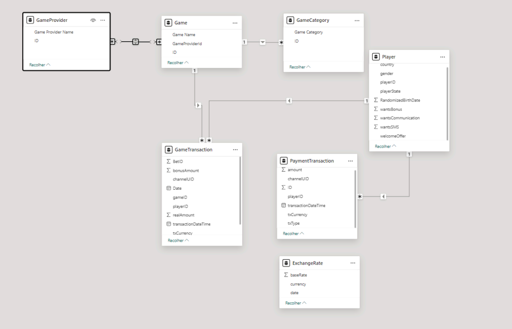

# README

## Overview
This Jupyter Notebook is designed to process and analyze game and payment transaction data. It includes various functions to convert data types, adjust timestamps, and perform currency conversions. The notebook also generates detailed metrics and profiles for players based on their transaction history.

## Structure
The notebook is divided into several sections:

1. **Functions**: Contains reusable functions for data processing.
2. **Timestamp Adjustment**: Functions to adjust and convert timestamps.
3. **Values Adjusted**: Functions to convert currency values.
4. **Currency Conversion**: Functions to convert currency based on exchange rates.
5. **Adding Datasources**: Loading data from CSV files.
6. **General Type Conversion**: Converting data types for consistency.
7. **Game Transaction**: Processing game transaction data.
8. **Payment Transaction**: Processing payment transaction data.
9. **Generating new DataFrames**: Creating new DataFrames for analysis.
10. **Hourly By Country**: Aggregating data by hour and country.
11. **Game Transaction Detailed**: Generating detailed game transaction data.
12. **Player Profile and Metrics**: Generating player profiles and metrics.

## Data Sources
The notebook uses the following data sources:
- `ExchangeRate.csv`: Contains exchange rate information.
- `Game.csv`: Contains game information.
- `Player.csv`: Contains player information.
- `GameCategory.csv`: Contains game category information.
- `GameProvider.csv`: Contains game provider information.
- `PaymentTransaction.csv`: Contains payment transaction data.
- `GameTransaction.csv`: Contains game transaction data.

## Output
The notebook generates several output files:
- `hourly_metrics.csv`: Contains hourly aggregated metrics.
- `game_transaction_detailed.csv`: Contains detailed game transaction data.
- `player_metrics.csv`: Contains player profiles and metrics.

## Usage
Run each cell sequentially to process the data and generate the output files. Make sure all the required data files are available in the `Files` directory.

## Dependencies
The notebook requires the following Python libraries:
- pandas
- IPython.display

Make sure to install these libraries before running the notebook.